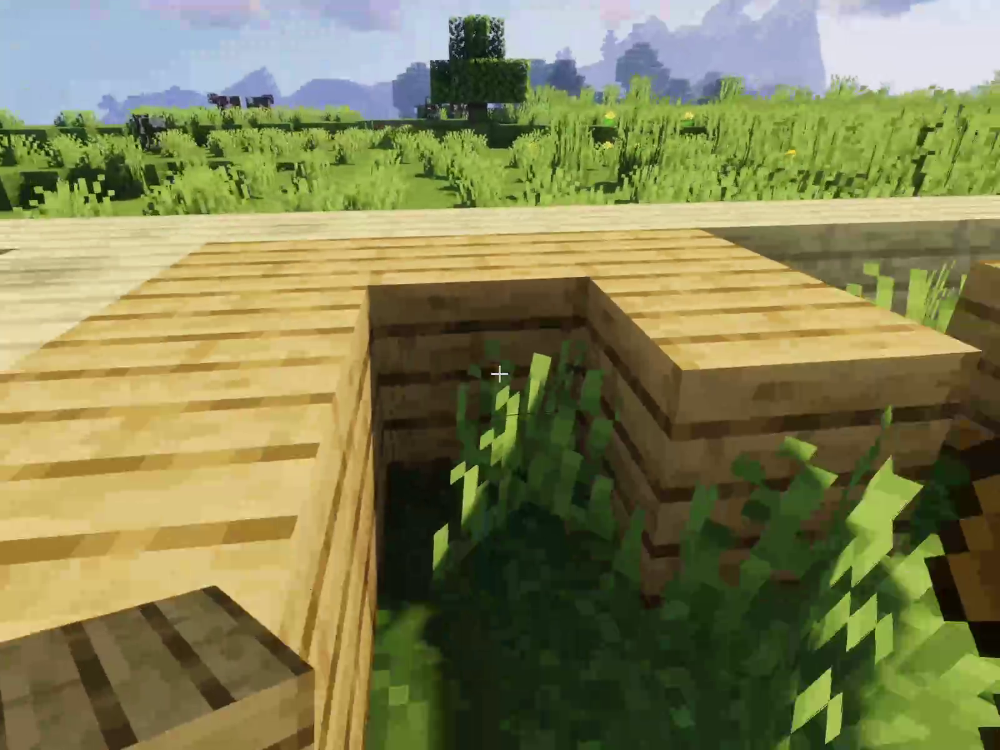
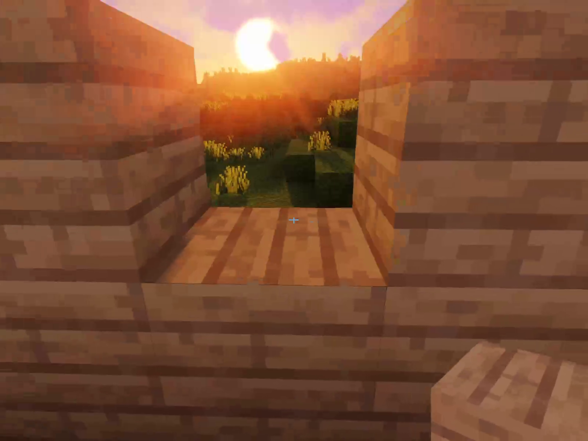
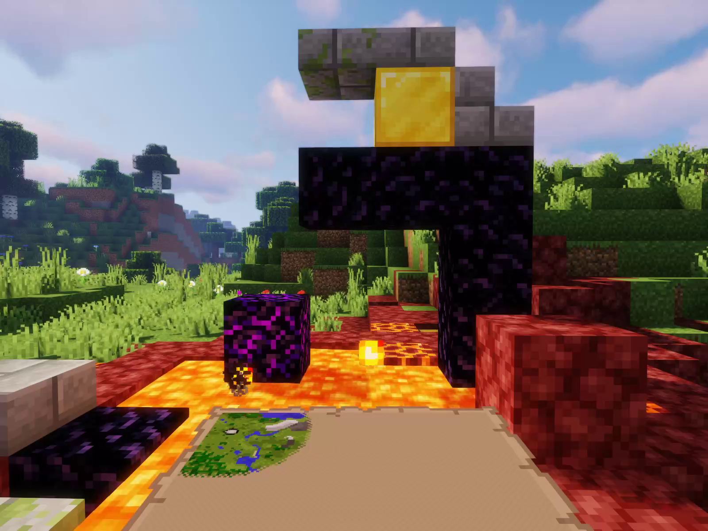
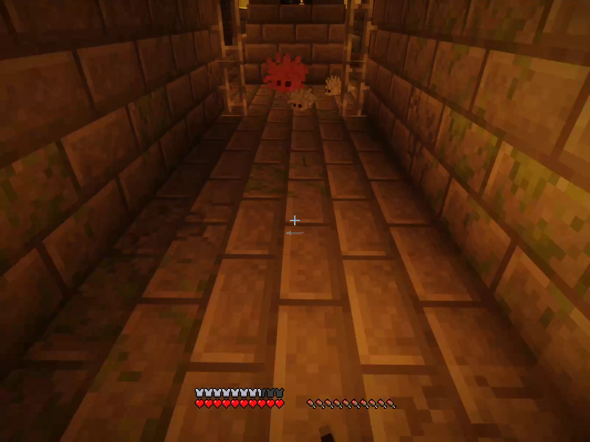
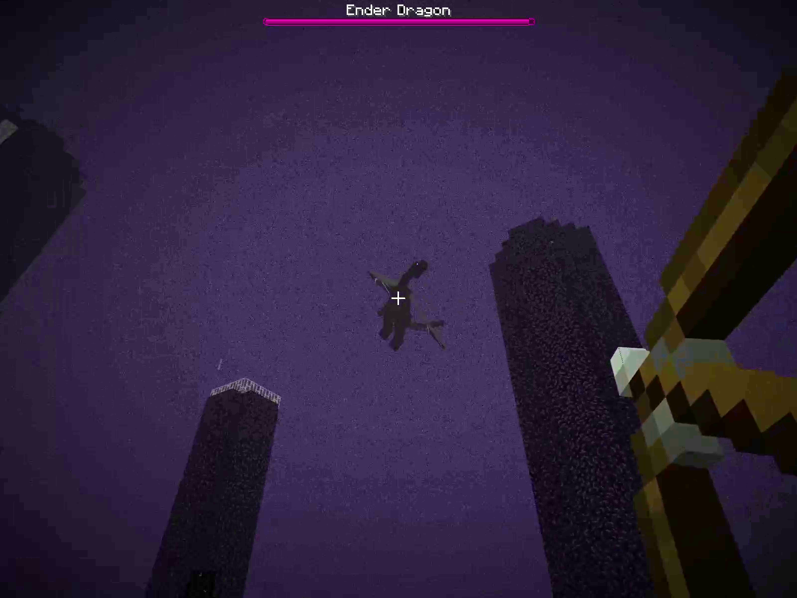

# MinecraftImmersiveHUD
This Minecraft mod aims to move the ingame HUD out of the way whenever possible. Whenever an element updates
(i.e., health changes, you swap items, you look at something, etc.), the respective item will show
up. However, once you've been able to see the information, it will fade away and allow you to enjoy
your game without the clutter of unneeded HUD elements.

The following elements will only show up under certain conditions:
* The health and armor bars will only show up when your health changes (i.e. after taking damage), when your health is low or when holding food.
* The hunger bar will only show up when your hunger level (not your saturation) changes, you are hungry, or when holding food.
* The experience bar and level will only show upon gaining experience.
* The health of your mount (i.e. your horse) will only show when its health changes.
* The horse jump bar will only show when you are getting ready to jump.
* The hotbar will only show when an item you are holding changes or you change which slot is selected.
* The crosshair will only show when you are looking at something or you are using a bow, crossbow, shield, or trident or holding a throwable item.
* The hands will show only when you use an item or are holding/using one of the above specified items, or a map.

# Installing
There are two variants of this mod: One for Forge, and the other for Fabric. Each [release](https://github.com/Markil3/MinecraftImmersiveHUD/releases) comes with jar files for both. You can download the appropriate jar file and place it within the "mods" folder within your Minecraft installation. For more details, see the README files of the appropriate branches.

# Building
Simply run the "gradle build" (or "./gradlew build" on OSX and Linux) to create a distributable jar file. You can find it within the build/libs directory.

# Licensing
This mod is licensed under the GNU General Public License version 3.0. In short, you are allowed to use and modify this mod for whatever you wish (including commercial use), but all distributions (modified or otherwise) must be under the same license, contain the source code (with changes highlighted), and preserve the copyright notices.
